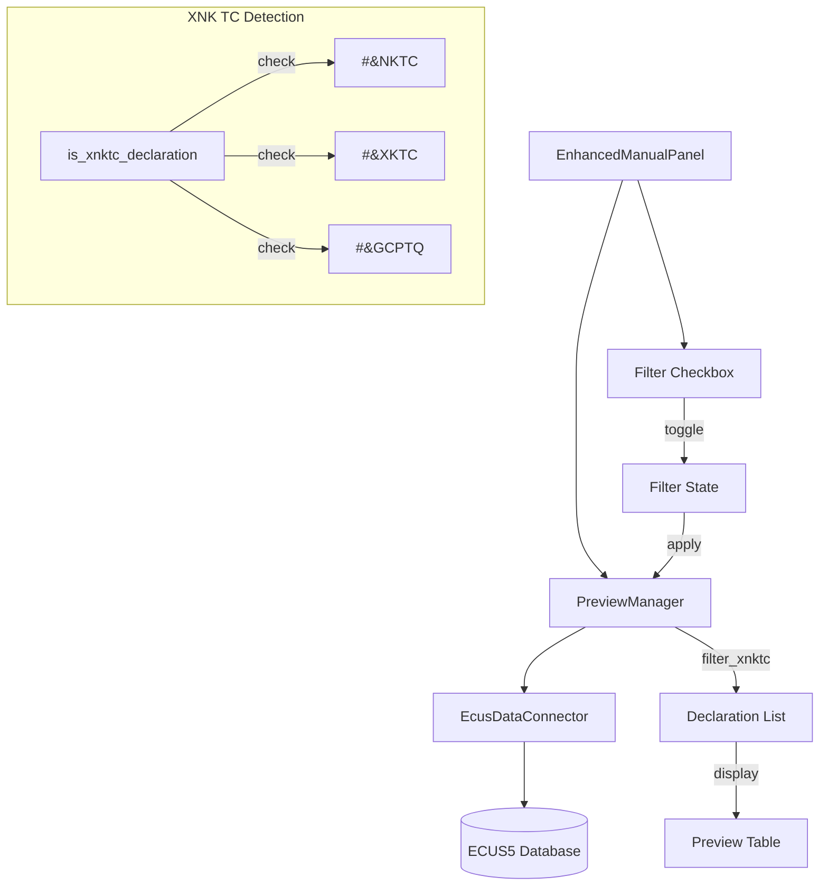

# Design Document: Filter XNK TC Declarations

## Overview

Tính năng này thêm khả năng lọc bỏ các tờ khai xuất nhập khẩu tại chỗ (XNK TC) trong khu vực xem trước tờ khai. Việc lọc dựa trên trường `SoHSTK` trong database ECUS5, kiểm tra các pattern đặc trưng: `#&NKTC`, `#&XKTC`, và `#&GCPTQ`.

## Architecture



## Components and Interfaces

### 1. Declaration Model Extension

Mở rộng model `Declaration` để bao gồm trường `so_hstk`:

```python
@dataclass
class Declaration:
    # ... existing fields ...
    so_hstk: Optional[str] = None  # Số hồ sơ tờ khai - dùng để nhận biết XNK TC
```

### 2. XNK TC Detection Utility

Tạo utility function để nhận biết tờ khai XNK TC:

```python
# Trong processors/preview_manager.py hoặc utils mới

XNKTC_PATTERNS = ['#&NKTC', '#&XKTC', '#&GCPTQ']

def is_xnktc_declaration(so_hstk: Optional[str]) -> bool:
    """
    Kiểm tra xem tờ khai có phải là XNK tại chỗ không
    
    Args:
        so_hstk: Giá trị trường SoHSTK từ database
        
    Returns:
        True nếu là tờ khai XNK TC, False nếu không
    """
    if not so_hstk:
        return False
    
    so_hstk_upper = so_hstk.upper()
    return any(pattern in so_hstk_upper for pattern in XNKTC_PATTERNS)
```

### 3. Database Query Extension

Mở rộng query trong `EcusDataConnector.get_declarations_by_date_range()` để lấy thêm trường `SoHSTK`:

```sql
SELECT 
    -- ... existing columns ...
    tk.SoHSTK as so_hstk
FROM DTOKHAIMD tk
-- ... rest of query ...
```

### 4. PreviewManager Extension

Thêm method lọc XNK TC trong `PreviewManager`:

```python
def filter_xnktc_declarations(
    self, 
    declarations: List[Declaration], 
    exclude_xnktc: bool = True
) -> List[Declaration]:
    """
    Lọc tờ khai XNK tại chỗ
    
    Args:
        declarations: Danh sách tờ khai
        exclude_xnktc: True để loại bỏ XNK TC, False để giữ tất cả
        
    Returns:
        Danh sách tờ khai đã lọc
    """
```

### 5. GUI Checkbox Component

Thêm checkbox trong `EnhancedManualPanel._create_preview_section()`:

```python
# Checkbox lọc XNK TC
self.exclude_xnktc_var = tk.BooleanVar(value=True)  # Mặc định bật
self.exclude_xnktc_checkbox = ttk.Checkbutton(
    control_row,
    text="Không lấy mã vạch tờ khai XNK TC",
    variable=self.exclude_xnktc_var,
    command=self._on_exclude_xnktc_changed
)
```

## Data Models

### Declaration Model Update

```python
@dataclass
class Declaration:
    declaration_number: str
    tax_code: str
    declaration_date: datetime
    customs_office_code: str
    transport_method: str = ""
    channel: str = ""
    status: str = ""
    goods_description: Optional[str] = None
    status_name: Optional[str] = None
    declaration_type: Optional[str] = None
    bill_of_lading: Optional[str] = None
    invoice_number: Optional[str] = None
    so_hstk: Optional[str] = None  # NEW: Số hồ sơ tờ khai
    
    @property
    def is_xnktc(self) -> bool:
        """Kiểm tra xem tờ khai có phải là XNK tại chỗ không"""
        if not self.so_hstk:
            return False
        so_hstk_upper = self.so_hstk.upper()
        return any(p in so_hstk_upper for p in ['#&NKTC', '#&XKTC', '#&GCPTQ'])
```

## Correctness Properties

*A property is a characteristic or behavior that should hold true across all valid executions of a system-essentially, a formal statement about what the system should do. Properties serve as the bridge between human-readable specifications and machine-verifiable correctness guarantees.*

### Property 1: XNK TC Pattern Detection

*For any* string value in the SoHSTK field, the `is_xnktc_declaration` function SHALL return True if and only if the string contains at least one of the patterns "#&NKTC", "#&XKTC", or "#&GCPTQ" (case-insensitive).

**Validates: Requirements 2.1, 2.2, 2.3, 2.5**

### Property 2: Filter Exclusion Completeness

*For any* list of declarations and filter enabled (exclude_xnktc=True), the filtered result SHALL NOT contain any declaration where `is_xnktc` property returns True.

**Validates: Requirements 1.3**

### Property 3: Filter Inclusion Completeness

*For any* list of declarations and filter disabled (exclude_xnktc=False), the filtered result SHALL contain all declarations from the original list (no declarations removed).

**Validates: Requirements 1.4**

### Property 4: Null/Empty SoHSTK Handling

*For any* declaration with null or empty SoHSTK field, the `is_xnktc` property SHALL return False (treated as normal declaration).

**Validates: Requirements 2.4**

### Property 5: Filter State Consistency

*For any* sequence of preview operations within a session, the filter SHALL be applied consistently according to the current checkbox state.

**Validates: Requirements 4.1, 4.2**

## Error Handling

| Error Scenario | Handling Strategy |
|----------------|-------------------|
| SoHSTK field missing in database | Treat as null, declaration is not XNK TC |
| Database query fails | Log error, show error message to user |
| Invalid pattern in SoHSTK | Ignore, treat as normal declaration |
| Filter toggle during preview | Queue refresh after current operation completes |

## Testing Strategy

### Property-Based Testing

Sử dụng thư viện `hypothesis` cho property-based testing:

```python
from hypothesis import given, strategies as st

@given(st.text())
def test_xnktc_pattern_detection(so_hstk):
    """Property 1: XNK TC Pattern Detection"""
    result = is_xnktc_declaration(so_hstk)
    # Verify result matches expected pattern detection
```

### Unit Testing

- Test `is_xnktc_declaration` với các giá trị cụ thể
- Test `filter_xnktc_declarations` với danh sách tờ khai mẫu
- Test checkbox default state
- Test filter toggle behavior

### Test Configuration

- Property tests: minimum 100 iterations
- Each property test tagged with: `**Feature: filter-xnktc-declarations, Property {number}: {property_text}**`
