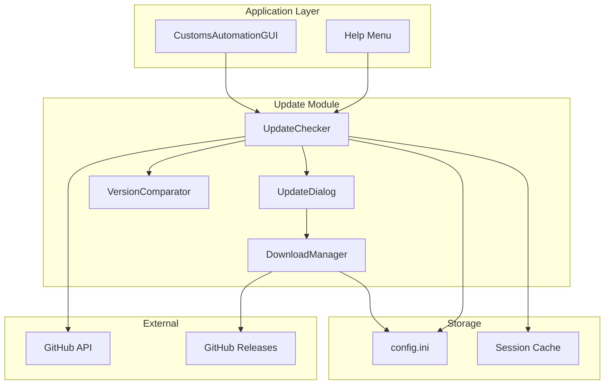

# Design Document: GitHub Auto-Update

## Overview

Tính năng Auto-Update cho phép ứng dụng Customs Barcode Automation tự động kiểm tra và tải về phiên bản mới từ GitHub Releases. Hệ thống sử dụng GitHub API để kiểm tra version, tải file .exe trực tiếp từ release assets, và hỗ trợ người dùng cài đặt bản mới.

## Architecture



## Components and Interfaces

### 1. UpdateChecker (`update/update_checker.py`)

Quản lý việc kiểm tra phiên bản mới từ GitHub.

```python
class UpdateChecker:
    GITHUB_API_URL = "https://api.github.com/repos/{owner}/{repo}/releases/latest"
    
    def __init__(self, current_version: str, github_repo: str, config_manager: ConfigurationManager):
        """
        Args:
            current_version: Version hiện tại của app (e.g., "1.2.3")
            github_repo: Repository path (e.g., "username/repo-name")
            config_manager: Để lưu/đọc skipped versions
        """
        
    def check_for_updates(self, force: bool = False) -> Optional[UpdateInfo]:
        """
        Kiểm tra cập nhật từ GitHub.
        
        Args:
            force: Bỏ qua cache và skipped versions
            
        Returns:
            UpdateInfo nếu có bản mới, None nếu không
        """
        
    def skip_version(self, version: str) -> None:
        """Đánh dấu version để không thông báo nữa."""
        
    def is_version_skipped(self, version: str) -> bool:
        """Kiểm tra version có bị skip không."""
        
    def get_pending_installer(self) -> Optional[str]:
        """Lấy path của installer đã download nhưng chưa cài."""
```

### 2. VersionComparator (`update/version_comparator.py`)

So sánh version theo semantic versioning.

```python
class VersionComparator:
    @staticmethod
    def parse_version(version_str: str) -> Tuple[int, int, int]:
        """
        Parse version string thành tuple (major, minor, patch).
        Tự động strip prefix "v" nếu có.
        
        Args:
            version_str: "1.2.3" hoặc "v1.2.3"
            
        Returns:
            (1, 2, 3)
            
        Raises:
            ValueError: Nếu format không hợp lệ
        """
        
    @staticmethod
    def compare(version1: str, version2: str) -> int:
        """
        So sánh 2 versions.
        
        Returns:
            -1 nếu version1 < version2
            0 nếu version1 == version2
            1 nếu version1 > version2
        """
        
    @staticmethod
    def is_newer(latest: str, current: str) -> bool:
        """Kiểm tra latest có mới hơn current không."""
```

### 3. DownloadManager (`update/download_manager.py`)

Quản lý việc tải file từ GitHub.

```python
class DownloadManager:
    def __init__(self, download_dir: str = None):
        """
        Args:
            download_dir: Thư mục lưu file download (default: temp)
        """
        
    def download_file(
        self, 
        url: str, 
        filename: str,
        expected_size: int = None,
        progress_callback: Callable[[int, int, float], None] = None
    ) -> str:
        """
        Download file với progress tracking.
        
        Args:
            url: URL của file
            filename: Tên file để lưu
            expected_size: Kích thước expected để verify
            progress_callback: Callback(downloaded_bytes, total_bytes, speed_bps)
            
        Returns:
            Path đến file đã download
            
        Raises:
            DownloadError: Nếu download thất bại
            DownloadCancelledError: Nếu user cancel
        """
        
    def cancel_download(self) -> None:
        """Cancel download đang chạy."""
        
    def verify_file(self, filepath: str, expected_size: int) -> bool:
        """Verify file size sau khi download."""
```

### 4. UpdateDialog (`gui/update_dialog.py`)

Dialog hiển thị thông tin cập nhật.

```python
class UpdateDialog:
    def __init__(self, parent: tk.Tk, update_info: UpdateInfo):
        """
        Args:
            parent: Parent window
            update_info: Thông tin về bản cập nhật
        """
        
    def show(self) -> str:
        """
        Hiển thị dialog và chờ user response.
        
        Returns:
            "update_now" | "remind_later" | "skip_version"
        """
```

### 5. Data Models (`update/models.py`)

```python
@dataclass
class UpdateInfo:
    """Thông tin về bản cập nhật."""
    current_version: str
    latest_version: str
    release_notes: str
    download_url: str
    file_size: int
    release_date: str
    
@dataclass
class DownloadProgress:
    """Trạng thái download."""
    downloaded_bytes: int
    total_bytes: int
    speed_bps: float  # bytes per second
    
    @property
    def percentage(self) -> float:
        if self.total_bytes == 0:
            return 0
        return (self.downloaded_bytes / self.total_bytes) * 100
    
    @property
    def speed_text(self) -> str:
        """Format speed: "1.5 MB/s" """
```

## Data Models

### Config Storage

```ini
[Update]
# GitHub repository (owner/repo)
github_repo = hochk2019/customs-barcode-automation

# Skipped versions (comma-separated)
skipped_versions = 

# Pending installer path (downloaded but not installed)
pending_installer = 

# Last check timestamp
last_check = 

# Check interval in hours (0 = every startup)
check_interval = 24
```

### GitHub API Response Structure

```json
{
  "tag_name": "v1.2.4",
  "name": "Version 1.2.4",
  "body": "## What's New\n- Feature 1\n- Bug fix 2",
  "published_at": "2024-12-12T10:00:00Z",
  "assets": [
    {
      "name": "CustomsBarcodeAutomation_V1.2.4.exe",
      "size": 45678901,
      "browser_download_url": "https://github.com/.../CustomsBarcodeAutomation_V1.2.4.exe"
    }
  ]
}
```

## Correctness Properties

*A property is a characteristic or behavior that should hold true across all valid executions of a system-essentially, a formal statement about what the system should do. Properties serve as the bridge between human-readable specifications and machine-verifiable correctness guarantees.*

### Property 1: Version Comparison Correctness
*For any* two valid semantic version strings, comparing them SHALL return consistent results where a newer version is always greater than an older version.
**Validates: Requirements 6.1**

### Property 2: Version Prefix Normalization
*For any* version string with or without "v" prefix, parsing SHALL produce the same numeric tuple (e.g., "v1.2.3" and "1.2.3" both yield (1, 2, 3)).
**Validates: Requirements 6.2**

### Property 3: Invalid Version Handling
*For any* malformed version string, parsing SHALL raise ValueError and the update check SHALL treat it as no update available.
**Validates: Requirements 6.3**

### Property 4: GitHub Response Parsing
*For any* valid GitHub API release response, parsing SHALL extract version, release notes, download URL, and file size correctly.
**Validates: Requirements 1.2**

### Property 5: Update Detection
*For any* pair of current and latest versions where latest > current, the update checker SHALL return UpdateInfo indicating an update is available.
**Validates: Requirements 1.3**

### Property 6: Skipped Version Persistence
*For any* version marked as skipped, subsequent update checks SHALL not notify for that version unless force=True.
**Validates: Requirements 2.4**

### Property 7: Download Progress Calculation
*For any* download state with downloaded_bytes and total_bytes, percentage SHALL be calculated as (downloaded/total)*100 and be between 0 and 100.
**Validates: Requirements 3.2**

### Property 8: File Size Verification
*For any* downloaded file, verification SHALL pass if and only if actual file size equals expected size.
**Validates: Requirements 3.3**

### Property 9: Download Cancellation
*For any* download in progress, calling cancel SHALL stop the download and raise DownloadCancelledError.
**Validates: Requirements 3.5**

### Property 10: Pending Installer Persistence
*For any* successfully downloaded installer with "install later" choice, the path SHALL be saved and retrievable on next startup.
**Validates: Requirements 4.4**

## Error Handling

### Network Errors
- Timeout sau 10 giây khi gọi GitHub API
- Retry 1 lần nếu thất bại
- Log error và tiếp tục khởi động app bình thường
- Hiển thị thông báo lỗi nếu user check thủ công

### Download Errors
- Retry download 2 lần nếu thất bại
- Cho phép user retry thủ công
- Xóa file partial nếu download thất bại
- Verify file size sau khi download

### Version Parse Errors
- Log warning nếu version format không hợp lệ
- Treat as no update available
- Không crash app

## Testing Strategy

### Property-Based Testing Library
Sử dụng **Hypothesis** cho Python property-based testing.

### Unit Tests
- Test VersionComparator với các edge cases
- Test GitHub response parsing
- Test download progress calculation
- Test config persistence

### Property-Based Tests
Mỗi correctness property sẽ được implement bằng một property test với Hypothesis:
- Generate random valid/invalid version strings
- Generate random GitHub API responses
- Generate random download states
- Minimum 100 iterations per property

### Integration Tests
- Mock GitHub API responses
- Test full update check flow
- Test download with mock server

### Test Annotation Format
```python
# **Feature: github-auto-update, Property 1: Version Comparison Correctness**
# **Validates: Requirements 6.1**
@given(...)
def test_version_comparison_property(self, ...):
    ...
```
